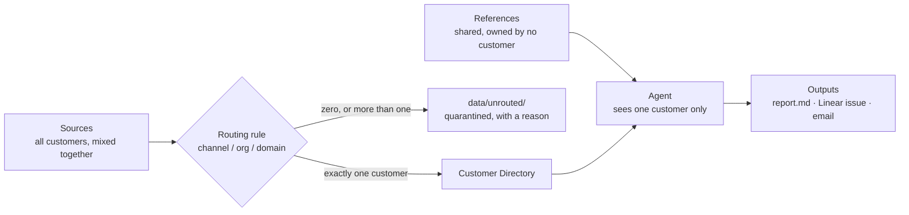
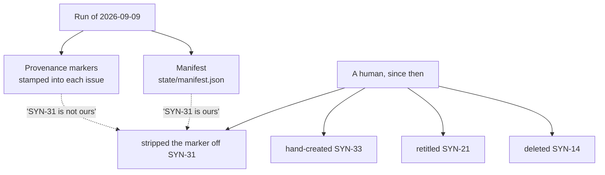

# Syncwell — workshop kit

Minso runs **Grantly**, a grant management platform, for three customers: a municipality, a
private foundation and a national agency. One project manager covers all three.

What that person needs to know is never in one place. A date changes in a Tuesday meeting and
nobody writes it down. A ticket is closed as solved, and three weeks later Slack says it still
happens. An email asks a direct question and no answer is ever sent. Each source looks fine on
its own — the problem only exists **between** them.

Build something that reads across sources and surfaces what needs attention. This repo gives
you the data, a mock of every external system, and one worked example of each half. The rest
is yours.

## What "done" looks like in 2.5 hours

Something that genuinely works across **two or three** sources, not a sketch covering five.
By the end you can run it in front of the room and it:

1. **Collects** two or three sources, every record either routed to exactly one customer or
   quarantined with a reason.
2. **Surfaces three things needing attention** for one customer, each citing the records it
   came from — and **at least one resting on two or more sources**. Single-source findings
   don't count; that's the part that doesn't need you.
3. **Writes an Output** — markdown at minimum, plus one Linear issue through the mock API.
4. **Has an answer for the second run.** Run it twice. Say what happened to what the first run
   created, and why that's the behaviour you chose.

Specific things are planted in this data, findable only by crossing sources. Your facilitator
knows what they are.

## Ground rules

- **Separation is deterministic** — decided by code over stable metadata, never by a prompt.
  An Agent gets one directory and no path to any other.
  ([ADR-0001](./docs/adr/0001-isolation-lives-in-the-routing-rule.md))
- **Quarantine, don't guess.** Anything that doesn't resolve to exactly one customer goes to
  `data/unrouted/` with a reason. Never dropped.
- **Cite your evidence.** Every finding names the records behind it.

Disagree with the shape below? Build it differently and tell us why.

## Quick start

```bash
docker compose up                    # mock API :8099, Mailpit :8025
go run ./cmd/collect -source slack        # Slack API -> per-customer directories
go run ./cmd/collect -source zammad       # support desk, same
go run ./cmd/collect -source transcripts  # transcript file drop, same
go run ./cmd/collect -source email        # mail file drop, same
```

```
routed      cust-nordstad-support -> nordstad (18 messages)
quarantined syncwell-internt (8 messages): channel "syncwell-internt" has no customer prefix
```

No Docker? `go run ./cmd/mockapi` — one binary, no dependencies. Port taken? Put
`MOCKAPI_PORT=9099` in a `.env`. Every endpoint needs `Authorization: Bearer <anything>`:

```bash
curl -H 'Authorization: Bearer dev' localhost:8099/        # route index
```

## The shape



**Collectors** are plain scripts; no model runs in one. **References** (`data/references/`)
are shared docs owned by no customer. **Outputs** are what the Agent maintains — some
internal, some a customer sees.

|            | Ships                                                                     | You write                  |
| ---------- | ------------------------------------------------------------------------- | -------------------------- |
| Sources    | Slack, Zammad (HTTP), transcripts, email (file drops)                     | —                          |
| Collectors | All four — [`internal/collect/`](./internal/collect/)                     | —                          |
| References | 15 documents                                                              | —                          |
| Outputs    | Markdown — [`internal/output/markdown.go`](./internal/output/markdown.go) | Spreadsheet, Linear, email |
| The Agent  | nothing                                                                   | all of it                  |

Each source directory has a README with the real vendor's API docs and its routing rule. The
Slack collector is ~150 lines; copy its shape. The Output writer takes JSON on stdin, which
keeps the Agent's judgement separate from the rendering:

```bash
echo '{"customer":"nordstad","run_at":"2026-09-16T09:00:00Z","items":[
  {"key":"launch-date-moved","title":"Launch date moved","severity":"high","evidence":[
    {"kind":"record","source":"transcript","path":"transcripts/2026-08-26-nordstad-styrgrupp.md",
     "locator":"L31","at":"2026-08-26","quote":"we are moving the public launch to 22 September"}]}]}' \
  | go run ./cmd/report
```

## Deliberately undecided

We have opinions, not answers. The data is arranged so you hit all of these.

1. **How does the Agent know what it created?** There's a run from 2026-09-09 in here — its
   Linear issues carry a marker, and `state/manifest.json` lists what it made. A human has
   since edited Linear, and **the two signals disagree.** Which one wins?


2. **What happens to a human's edits?** Respect them, revert them, or notice and ask?
3. **Where must a human approve?** Some actions are safe to take. Emailing a customer isn't.
4. **How much config is real?** Per-source and per-customer prompts — we suspect they're
   needed, haven't built them, might be wrong.
5. **Cross-customer themes.** A stretch goal, and a second Agent — not a flag on this one.

## Layout

```
cmd/mockapi         mock Slack, Zammad and Linear APIs
cmd/collect         reference Slack collector
cmd/report          reference markdown output writer
config/             customers, domains, routing rules
data/sources/       what the vendor sees: all customers, mixed together
data/references/    shared product documentation
data/customers/     collector output, one per customer, plus state/ and outputs/
data/unrouted/      quarantine
data/linear/        the mock Linear workspace
docs/DATA-FORMATS.md   exact shape of every file
CONTEXT.md          the vocabulary; use these words
```

The data is invented. Nothing in it comes from a real customer.
